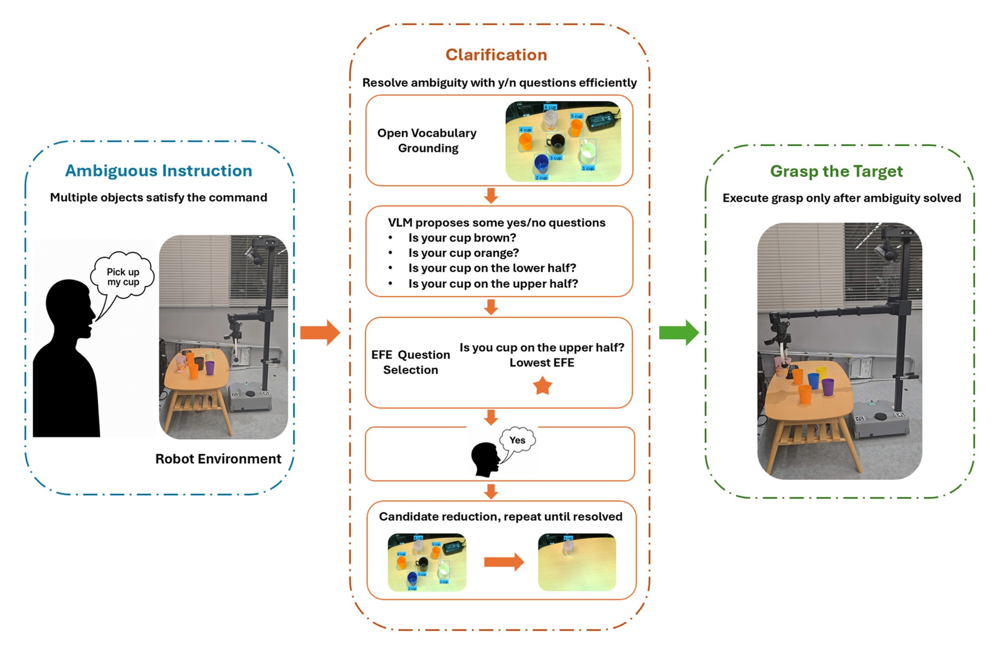

# ActivAsk: Free-Energy-Guided Clarification for Robotic Grasping under Ambiguous Instructions

<p align="center">
  <a href="https://yhad666.github.io/ActivAsk/">Project Page</a> ·
  <a href="https://github.com/yhad666/ActivAsk">Code</a> ·
  <a href="https://github.com/yhad666/ActivAsk/tree/main/data">Data & Analysis</a> ·
  <a href="https://raw.githubusercontent.com/yhad666/ActivAsk/main/videos/demo.mp4">Demo Video</a>
</p>

<p align="center"><strong>Haoandong Yang</strong> · Gabriel W. Haddon-Hill · Teresa Zielinska · Shingo Murata</p>
<p align="center"><em>Murata Laboratory · Keio University</em></p>
<p align="center"><strong>Submitted, 2026</strong></p>

<p align="center">
  <a href="https://yhad666.github.io/ActivAsk/"></a>
</p>

## Abstract

Robotic manipulation often fails before grasping begins: a referring instruction may not uniquely identify one visible object. ActivAsk treats clarification as an active inference problem. It constructs open-vocabulary candidates from RGB-D observations, proposes candidate-grounded yes/no questions, selects a partition using an expected-free-energy criterion, updates the candidate state from the user's answer, and executes the grasp only after the target is resolved.

The public release includes the evaluation data, prompt materials, calibration sweep, scene observations, analysis scripts, minimal policy implementation, and real-robot supplementary videos.

## Real-World Demo

The project page contains the playable 67-second real-robot demonstration. It shows ActivAsk resolving ambiguity among multiple cups in a cluttered tabletop scene and then executing the corresponding grasp with a Hello Robot Stretch platform.

<p align="center"><a href="https://yhad666.github.io/ActivAsk/"><strong>▶ Open the interactive project page to play the demo</strong></a></p>

<p align="center"><a href="https://raw.githubusercontent.com/yhad666/ActivAsk/main/videos/demo.mp4">Download the MP4 directly</a></p>

## What ActivAsk Does

| Stage | Description |
| --- | --- |
| Perceive | Construct open-vocabulary object candidates from RGB-D input. |
| Clarify | Ask a candidate-grounded yes/no question when the instruction is ambiguous. |
| Update | Eliminate candidates that are inconsistent with the user's answer. |
| Execute | Pass the resolved target to the robot for grasp execution. |

## Study Snapshot

- **1,512 offline trials** for target-resolution analysis.
- **228 online trials** for real-robot execution analysis.
- **Robot platform:** Hello Robot Stretch SE3 / Stretch 3-class mobile manipulator.
- **Camera:** head-mounted Intel RealSense D435i RGB-D camera.

## Repository Structure

- `data/`: public offline and online trial records, scenes, instruction pools, and calibration data.
- `prompts/`: VLM system prompt, policy-specific role instructions, direct-decision prompt, and JSON schemas.
- `activask/`: minimal policy implementation for tokenization, candidate-state updates, question selection, baselines, and execution gating.
- `analysis/`: scripts for generating analysis tables and threshold-sweep plots.
- `examples/`: minimal offline/online examples, EFE selection demo, and model setup template.
- `videos/`: supplementary real-robot videos grouped by object category and outcome.

## Quick Start

The released analysis tables can be generated without robot hardware or model weights:

```bash
python -m venv .venv
source .venv/bin/activate
pip install -r requirements.txt
python analysis/run_tables.py
```

Optional checks:

```bash
python analysis/plot_threshold_sweep.py
python examples/efe_selection_demo.py
python examples/offline_trial_demo.py
python examples/online_trial_demo.py
```

## Paper Status

The manuscript is listed as **submitted in 2026**. The official publication record is maintained by the [Murata Laboratory](https://murata-lab.jp/publications/?lang=en); a public paper or preprint link will be added here when available.

## Citation

```bibtex
@article{yang2026activask,
  title   = {ActivAsk: Free-Energy-Guided Clarification for Robotic Grasping under Ambiguous Instructions},
  author  = {Yang, Haoandong and Haddon-Hill, Gabriel W. and Zielinska, Teresa and Murata, Shingo},
  year    = {2026},
  note    = {Submitted manuscript}
}
```

## Licenses

Code is released under the MIT License. Data, scene images, calibration tables, instruction pools, and videos are released under CC BY 4.0; see `DATA_LICENSE`.
